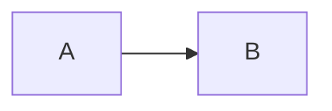
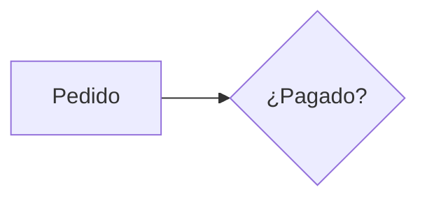
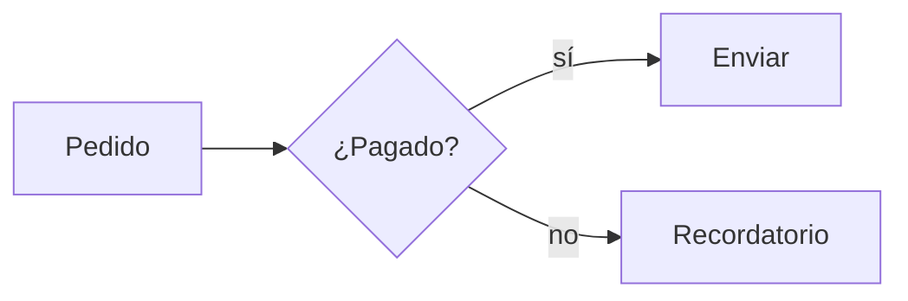

# Slidev cheatsheet

Quick reference for writing and editing `slides.md`. Full docs: https://sli.dev

> Based on the [Slidev documentation](https://sli.dev)
> ([source](https://github.com/slidevjs/slidev/tree/main/docs)),
> MIT License, Copyright (c) 2020-PRESENT Anthony Fu.

## File anatomy

```md
---
# headmatter: the first frontmatter configures the whole deck AND slide 1
theme: default            # or seriph, apple-basic… (npm: @slidev/theme-<name> or slidev-theme-<name>)
title: Mi charla
info: Descripción corta
colorSchema: auto         # auto | light | dark
transition: slide-left    # default transition for every slide
mdc: true                 # enables [texto]{.clase} and ::component:: syntax
fonts:
  sans: Inter
  mono: Fira Code
layout: cover
---

# Título de la portada

---
layout: center
transition: fade
---

# Slide 2

<!--
Notas del presentador: el último comentario HTML de una slide.
-->
```

- Slides are separated by a line containing only `---`. A `---` block
  immediately followed by `key: value` lines and another `---` is that slide's
  frontmatter, not an extra slide.
- **Counting slides:** slide 1 is the headmatter + its content; each following
  `---` separator starts a new slide. Code fences can contain `---`; ignore
  anything inside ``` fences when counting.
- Split long decks: a slide with frontmatter `src: ./pages/intro.md` imports
  that file's slides in place.

## Layouts (`layout:` in slide frontmatter)

| Layout | Use |
|---|---|
| `cover` | Title slide |
| `intro` | Speaker/intro |
| `section` | Section divider |
| `center` | Centered content |
| `default` | Normal content |
| `two-cols` | Two columns; put `::right::` where the right column starts |
| `two-cols-header` | Header row + `::left::` / `::right::` |
| `image-right` / `image-left` | Content + image; `image: /foto.png` (from `public/`) or a URL |
| `image` | Full-bleed image; `image:` + optional `backgroundSize: contain` |
| `statement` / `fact` / `quote` | Big single message / number / quote |
| `iframe` / `iframe-right` | `url:` embed |
| `end` | Closing slide |

Other per-slide keys: `class: text-center`, `background: /bg.jpg`,
`transition:`, `clicks: 3`, `hide: true`, `zoom: 0.8`.

## Click animations

```md
<v-clicks>

- Aparece primero
- Luego este

</v-clicks>

<v-click>Aparece al hacer click</v-click>
<div v-click="3">Aparece en el click 3</div>
<div v-after>Aparece junto con el anterior</div>
<div v-click.hide>Se oculta al hacer click</div>
<v-clicks depth="2">…</v-clicks>   <!-- listas anidadas -->
```

Blank lines around the markdown inside `<v-clicks>` are required.

## Motion (`@vueuse/motion`, built in)

```html
<div
  v-motion
  :initial="{ x: -80, opacity: 0 }"
  :enter="{ x: 0, opacity: 1, transition: { duration: 600, delay: 100 } }"
  :click-1="{ scale: 1.5 }"
  :leave="{ y: 30, opacity: 0 }"
>
  Contenido
</div>
```

- "Bigger animation" usually means larger `x`/`y` distance, larger `scale`,
  longer `duration`, or making the element itself bigger (`text-6xl`,
  `w-120`, `scale-150`). Ask only if genuinely ambiguous; otherwise pick the
  most literal reading and say what you changed.
- `:click-N` states animate on click N.

## Slide transitions

`fade`, `fade-out`, `slide-left`, `slide-right`, `slide-up`, `slide-down`,
`view-transition`. Different forward/back: `transition: slide-left | slide-right`.

## Styling

- UnoCSS (Tailwind-compatible) classes work everywhere:
  `text-4xl`, `font-bold`, `text-red-500`, `grid grid-cols-2 gap-4`,
  `absolute bottom-10 right-10`, `opacity-50`, `rounded-xl shadow`.
- With `mdc: true`: `[importante]{.text-red-500 .font-bold}`.
- Per-slide CSS: a `<style>` block inside the slide is scoped to it.
- Global CSS: `style.css` at the project root (auto-loaded).

## Code

`````md
```ts {2|4-6|all}
// stepped line highlighting per click
```

```ts {lines:true,startLine:5}
```

```ts {monaco}
// editable editor in the slide
```

````md magic-move
```js
const a = 1
```
```js
const a = 1
const b = 2
```
````
`````

## Diagrams

````md

````

- Keep it narrow enough for the slide (~4–5 nodes per row). Clipped diagrams
  are the most common export bug.
- One themed diagram → `%%{init: {'theme':'base','themeVariables':{…}}}%%` as
  the first line of the block. Several → one `setup/mermaid.ts` for the whole
  deck:

```ts
// setup/mermaid.ts
import { defineMermaidSetup } from '@slidev/types'

export default defineMermaidSetup(() => ({
  theme: 'base',
  themeVariables: {
    background: 'transparent',
    primaryColor: '#241809', primaryTextColor: '#fff4dc',
    primaryBorderColor: '#f5a524', lineColor: '#ffd27a',
    pie1: '#f5a524', pie2: '#ffd27a', pie3: '#7a4a14', pieOpacity: '1',
  },
}))
```

## Animated diagrams

A Mermaid block renders as one SVG, all at once; `v-click` cannot reveal its
individual nodes. To animate a diagram, pick one of these:

**A. Linear flow, up to ~5 nodes → HTML nodes with `v-click`.** Each click
shows an arrow and the next node together (`v-after`). This one looks best.

```html
<div class="flex items-center justify-center gap-4 mt-16 text-xl">
  <div class="px-5 py-3 rounded-lg border-2 border-teal-500">Cliente</div>
  <div v-click class="text-3xl opacity-70">→</div>
  <div v-after class="px-5 py-3 rounded-lg border-2 border-teal-500">API</div>
  <div v-click class="text-3xl opacity-70">→</div>
  <div v-after class="px-5 py-3 rounded-lg border-2 border-teal-500">Base de datos</div>
</div>
```

For a stronger entrance, give each node `v-motion` with
`:initial="{ y: 30, opacity: 0 }"` and `:click-N="{ y: 0, opacity: 1 }"`
instead of `v-click`/`v-after`. Use `flex-col` for vertical flows.

**B. Branches, cycles, sequence or state diagrams → Mermaid steps with
`<v-switch>`.** Each step is the previous one plus the next nodes; one step
is shown per click, and the last one is the complete diagram.

`````md
<v-switch>
<template #1>



</template>
<template #2>



</template>
</v-switch>
`````

- Blank lines around each code fence inside `<template>` are required.
- Keep the same node IDs, labels, declaration order, direction and `scale`
  in every step, so earlier nodes stay in place as new ones appear.
- The first step appears on the first click. Put the slide's title or a
  one-line lead above `<v-switch>` so the slide does not open empty.
- The PDF export shows the last step, so that step must be the full diagram.
- 2–4 steps is enough; group related nodes into one step.

## Math (KaTeX)

Inline `$E = mc^2$`, block `$$ … $$`. **Formulas only render in Markdown
context.** Inside an HTML element on the same line they show as raw LaTeX:

```md
<!-- ❌ sale en crudo -->
<div class="card">$6 \times n$</div>

<!-- ✅ línea en blanco antes y después de la fórmula -->
<div class="card">
<div class="label">Con un six</div>

$$\textcolor{#f5a524}{6} \times n$$

</div>
```

- Rules for the ✅ form: HTML lines not indented more than 3 spaces, and a
  blank line before and after the formula.
- For a nicer look: `\textcolor{#hex}{…}` for accent colors,
  `\underbrace{x}_{\text{label}}` for labels, `\;` for spacing, and size it
  from a wrapper (`<div class="text-3xl">` + blank line + `$$…$$`).
- Tweak spacing per slide:
  `<style>.katex-display { margin: .4em 0 }</style>`.

## Export-safe styling (PDF)

`slidev export` prints with Chromium. These render fine on screen but break in
the PDF:

| Avoid | Use instead |
|---|---|
| `box-shadow: 0 0 40px rgba(…)` (glow) | radial-gradient glow (below) |
| `filter: blur()` / `drop-shadow()` / `backdrop-filter` | nothing, or a gradient |
| `background-clip: text` (gradient text) | solid `color` |
| looping CSS `@keyframes` | static state when `useNav().isPrintMode` |

```css
/* glow that survives PDF export */
.glow { position: relative; isolation: isolate; }
.glow::before {
  content: ''; position: absolute; inset: -35%; z-index: -1;
  pointer-events: none;
  background: radial-gradient(closest-side, rgba(245,165,36,.45), transparent);
}
```

`v-motion` and `v-click` are safe: export renders their final state.

## Assets & components

- Files in `public/` are served from `/` → ``.
- `.vue` files in `components/` are auto-imported: `<MiComponente />`.
- Built-ins: `<Arrow x1 y1 x2 y2 />`, `<Tweet id="…"/>`, `<Youtube id="…"/>`,
  `<Toc />`, `<SlideCurrentNo />`, `<Transform :scale="0.8">`.

## Commands (suggest them; do not run them for the user)

- `npm install` — once.
- `npm run dev` — dev server with hot reload (http://localhost:3030).
- `npm run export` — PDF (needs `playwright-chromium`, already in the starter).
  If it fails because Chromium is missing (newer npm blocks install scripts),
  suggest `npx playwright install chromium` once.
  `npm run export -- --format pptx` or `--format png` for other formats.
- `npm run build` — static SPA in `dist/` for hosting.
